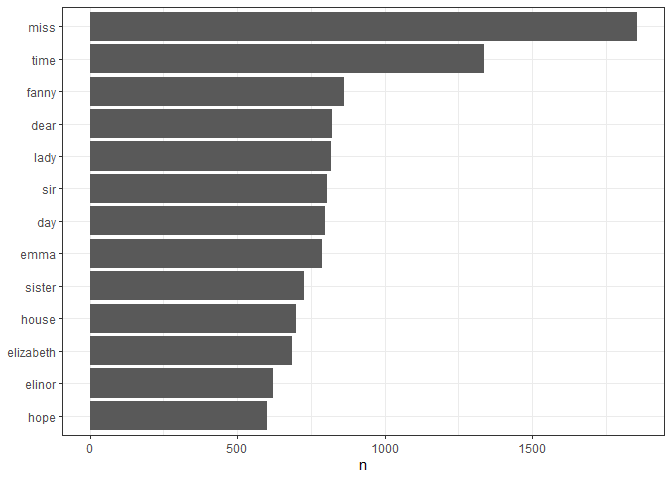
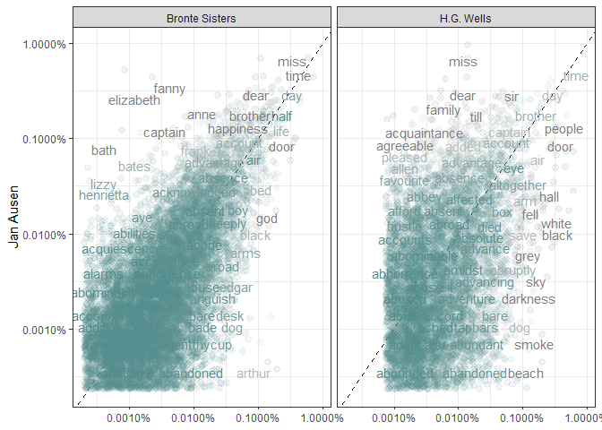
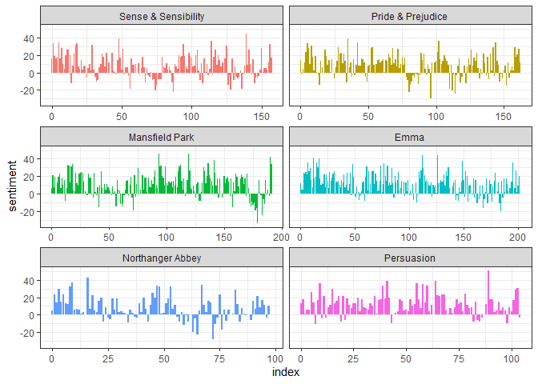
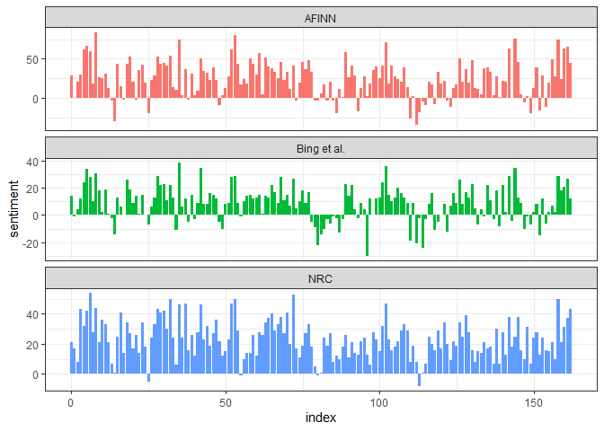
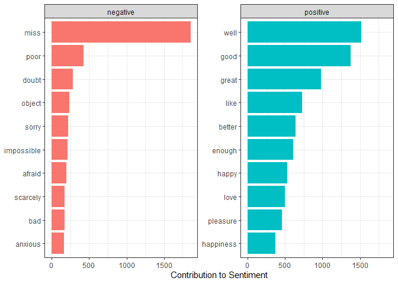
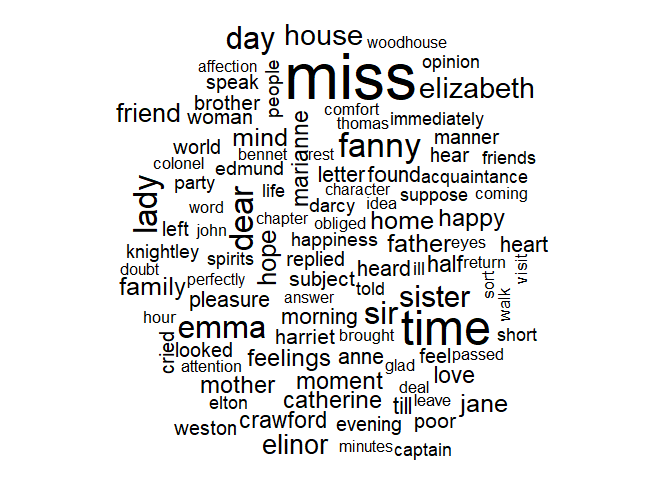
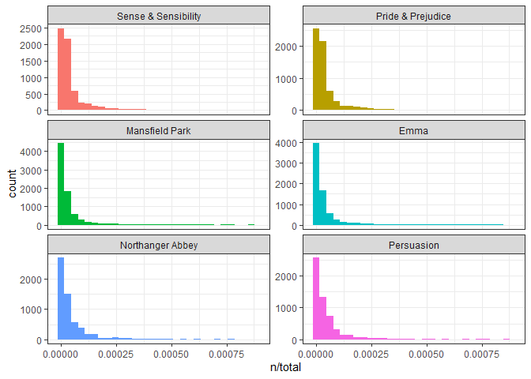
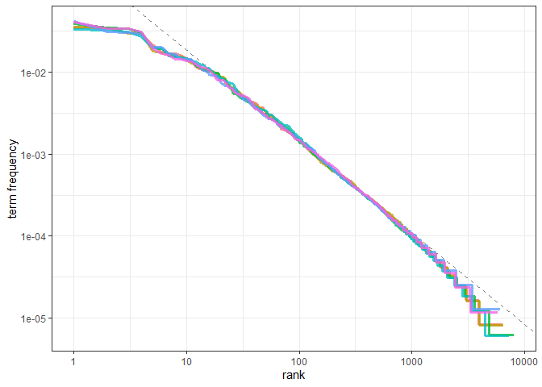
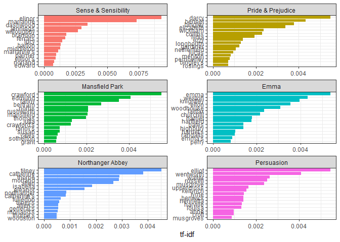

Text Mining
================
yihun
5/29/2020

## Chapter 1

Tidy text formats as being a table with one-token-per-row. Structuring
text data i this way means that it conforms to tidy data principles and
can be manipulated with a set of consistent tools. This is worth
contrasting with the ways text i often stored in text mining approaches.

  - String : Text can, of course, be stored as strings.
  - Corpus: Raw strings annotated with additional metadata and
    details.  
  - Document-term matrix: Sparse matrix describing a collection of
    documents.

<!-- end list -->

``` r
library(dplyr)
library(ggplot2)
library(tidytext)
theme_set(theme_bw())
```

### `unnes_tokens`

``` r
text <- c("Because I could not stop for Death -",
          "He kindly stopped for me -",
          "The Carriage held but just Ourselves -",
          "and Immortality")

text
```

    FALSE [1] "Because I could not stop for Death -"  
    FALSE [2] "He kindly stopped for me -"            
    FALSE [3] "The Carriage held but just Ourselves -"
    FALSE [4] "and Immortality"

This is a typical character vector that we might want to analyze. In
order to turn it into a tidy text dataset, we first need to put it into
a data frame.

``` r
text_df <- tibble( line = 1:4,text= text)
```

> A token is a meaningful unit of text, most often a word, that we are
> interested in using for further analysis, and tokenization is the
> process of splitting text into tokens.

``` r
text_df %>%
  unnest_tokens(word, text) 
```

    FALSE # A tibble: 20 x 2
    FALSE     line word       
    FALSE    <int> <chr>      
    FALSE  1     1 because    
    FALSE  2     1 i          
    FALSE  3     1 could      
    FALSE  4     1 not        
    FALSE  5     1 stop       
    FALSE  6     1 for        
    FALSE  7     1 death      
    FALSE  8     2 he         
    FALSE  9     2 kindly     
    FALSE 10     2 stopped    
    FALSE 11     2 for        
    FALSE 12     2 me         
    FALSE 13     3 the        
    FALSE 14     3 carriage   
    FALSE 15     3 held       
    FALSE 16     3 but        
    FALSE 17     3 just       
    FALSE 18     3 ourselves  
    FALSE 19     4 and        
    FALSE 20     4 immortality

*The two basic arguments to `unnest_tokens` used her are column names.
First we have the output column names.*

### Tyding the work fo Jane Austen

``` r
# install.packages("janeaustenr")

library(janeaustenr)
library(stringr)

original_books <- austen_books() %>% 
  group_by(book) %>%
  mutate(linenumber = row_number(),
         chapter = cumsum(str_detect(text, regex("^chapter [\\divxlc]",
                                                 ignore_case = TRUE)))) %>% 
  ungroup()
  
  
original_books
```

    FALSE # A tibble: 73,422 x 4
    FALSE    text                    book                linenumber chapter
    FALSE    <chr>                   <fct>                    <int>   <int>
    FALSE  1 "SENSE AND SENSIBILITY" Sense & Sensibility          1       0
    FALSE  2 ""                      Sense & Sensibility          2       0
    FALSE  3 "by Jane Austen"        Sense & Sensibility          3       0
    FALSE  4 ""                      Sense & Sensibility          4       0
    FALSE  5 "(1811)"                Sense & Sensibility          5       0
    FALSE  6 ""                      Sense & Sensibility          6       0
    FALSE  7 ""                      Sense & Sensibility          7       0
    FALSE  8 ""                      Sense & Sensibility          8       0
    FALSE  9 ""                      Sense & Sensibility          9       0
    FALSE 10 "CHAPTER 1"             Sense & Sensibility         10       1
    FALSE # ... with 73,412 more rows

To work with the above dataset, we need to restructure it in the
one-token-per-row format.

``` r
tidy_books <- original_books %>%
  unnest_tokens(word, text)
  
tidy_books
```

    FALSE # A tibble: 725,055 x 4
    FALSE    book                linenumber chapter word       
    FALSE    <fct>                    <int>   <int> <chr>      
    FALSE  1 Sense & Sensibility          1       0 sense      
    FALSE  2 Sense & Sensibility          1       0 and        
    FALSE  3 Sense & Sensibility          1       0 sensibility
    FALSE  4 Sense & Sensibility          3       0 by         
    FALSE  5 Sense & Sensibility          3       0 jane       
    FALSE  6 Sense & Sensibility          3       0 austen     
    FALSE  7 Sense & Sensibility          5       0 1811       
    FALSE  8 Sense & Sensibility         10       1 chapter    
    FALSE  9 Sense & Sensibility         10       1 1          
    FALSE 10 Sense & Sensibility         13       1 the        
    FALSE # ... with 725,045 more rows

### Data Cleaning

``` r
# Remove stop words 
data("stop_words")

tidy_books <- tidy_books %>% 
  anti_join(stop_words)

tidy_books %>% 
  count(word, sort = TRUE)
```

    FALSE # A tibble: 13,914 x 2
    FALSE    word       n
    FALSE    <chr>  <int>
    FALSE  1 miss    1855
    FALSE  2 time    1337
    FALSE  3 fanny    862
    FALSE  4 dear     822
    FALSE  5 lady     817
    FALSE  6 sir      806
    FALSE  7 day      797
    FALSE  8 emma     787
    FALSE  9 sister   727
    FALSE 10 house    699
    FALSE # ... with 13,904 more rows

### Visualization

``` r
tidy_books %>% 
  count(word, sort= TRUE) %>% 
  filter(n > 600) %>% 
  mutate(word = reorder(word, n)) %>% 
  ggplot(aes(word, n))+
  geom_col()+
  xlab(NULL)+
  coord_flip()
```

<!-- -->

Now we may need to perform cleaning of text data, such as removing
copyright headers or formatting.

``` r
library(gutenbergr)

 # Getting H.G. Wells from the project
hgwell <- gutenberg_download(c(35,36, 5230,159))

tidy_hgwell <- hgwell %>% 
  unnest_tokens(word, text) %>% 
  anti_join(stop_words)
```

### What are most common words in H.G. Wells?

``` r
count(tidy_hgwell, word, sort=TRUE)
```

    FALSE # A tibble: 11,769 x 2
    FALSE    word       n
    FALSE    <chr>  <int>
    FALSE  1 time     454
    FALSE  2 people   302
    FALSE  3 door     260
    FALSE  4 heard    249
    FALSE  5 black    232
    FALSE  6 stood    229
    FALSE  7 white    222
    FALSE  8 hand     218
    FALSE  9 kemp     213
    FALSE 10 eyes     210
    FALSE # ... with 11,759 more rows

``` r
# Getting some well-known works of the Bronte sisters from the gutenberg project

bronte <- gutenberg_download(c(1260, 768, 969, 9182, 767))

tidy_bronte <- bronte %>% 
  unnest_tokens(word, text) %>% 
  anti_join(stop_words)

tidy_bronte %>% 
  count(word, sort= TRUE)
```

    FALSE # A tibble: 23,050 x 2
    FALSE    word       n
    FALSE    <chr>  <int>
    FALSE  1 time    1065
    FALSE  2 miss     855
    FALSE  3 day      827
    FALSE  4 hand     768
    FALSE  5 eyes     713
    FALSE  6 night    647
    FALSE  7 heart    638
    FALSE  8 looked   601
    FALSE  9 door     592
    FALSE 10 half     586
    FALSE # ... with 23,040 more rows

### Calculate the frequency for each word for the works of Jan Austen, Bronte sisters and H.G. Wells.

``` r
library(tidyr)
frequncy <- bind_rows(mutate(tidy_bronte, author = "Bronte Sisters"),
                      mutate(tidy_hgwell, author = "H.G. Wells"),
                      mutate(tidy_books, author = "Jane Austen")) %>% 
  mutate(word = str_extract(word,"[a-z]+")) %>% 
  count(author, word) %>% 
  group_by(author) %>% 
  mutate(proportion = n/sum(n)) %>% 
  select(-n) %>% 
  spread(author, proportion) %>% 
  gather(author , proportion, `Bronte Sisters` : `H.G. Wells`)
```

``` r
library(scales)

ggplot(frequncy, aes(x = proportion, y = `Jane Austen`, color = abs(`Jane Austen`- proportion)))+
  geom_abline(color = "gray6 ", lty = 2)+
  geom_jitter(alpha = 0.1, size = 2.5, width = 0.3, height = 0.3)+
  geom_text(aes(label = word), check_overlap = TRUE, vjust = 1.5)+
  scale_x_log10(labels = percent_format())+
  scale_y_log10(labels = percent_format())+
  scale_color_gradient(limits = c(0,0.001), low = "darkslategray4", high = "gray75")+
  facet_wrap(~ author, ncol = 2)+
  theme(legend.position = "none")+
  labs(y = "Jan Ausen", x = NULL)
```

<!-- -->

Words that are close to the line in these plots have similar frequencies
in both sets of texts, for example, in both Austen and Brontë texts
(“miss”, “time”, “day” at the upper frequency end) or in both Austen
and Wells texts (“time”, “day”, “brother” at the high frequency end).
Words that are far from the line are words that are found more in one
set of texts than another. For example, in the Austen-Brontë panel,
words like “elizabeth”, “emma”, and “fanny” (all proper nouns) are found
in Austen’s texts but not much in the Brontë texts, while words like
“arthur” and “dog” are found in the Brontë texts but not the Austen
texts. In comparing H.G. Wells with Jane Austen, Wells uses words like
“beast”, “guns”, “feet”, and “black” that Austen does not, while
Austen uses words like “family”, “friend”, “letter”, and “dear” that
Wells does not.

Words in the Austen-Brontë panel are closer to the zero-slope line than
in the Austen-Wells panel. Also notice that the words extend to lower
frequencies in the Austen-Brontë panel; there is empty space in the
Austen-Wells panel at low frequency. These characteristics indicate that
Austen and the Brontë sisters use more similar words than Austen and
H.G. Wells. Also, we see that not all the words are found in all three
sets of texts and there are fewer data points in the panel for Austen
and H.G. Wells.

> Let’s quantify how similar and different these sets of word
> frequencies are using a correlation test. How correlated are the word
> frequencies between Austen and the Brontë sisters, and between Austen
> and Wells?

``` r
cor.test(data  = frequncy[frequncy$author == "Bronte Sisters",], ~ proportion + `Jane Austen`)
```

    FALSE 
    FALSE   Pearson's product-moment correlation
    FALSE 
    FALSE data:  proportion and Jane Austen
    FALSE t = 116.36, df = 10302, p-value < 2.2e-16
    FALSE alternative hypothesis: true correlation is not equal to 0
    FALSE 95 percent confidence interval:
    FALSE  0.7451142 0.7618049
    FALSE sample estimates:
    FALSE      cor 
    FALSE 0.753581

Just as we saw in the plots, the word frequencies are more correlated
between the Austen and Brontë novels than between Austen and H.G. Wells.

## Chapter 2

One way to analyze the sentiment of a text is to consider the text as a
combination of its individual words and the sentiment content of the
whole text as the sum of the sentiment of the content of the individual
words.

### The `sentiment` dataset

There are a variety of methods and discussions and dictionaries that
exists for evaluating the opinion or emotion in text.

  - `AFINN` from the Finn Arup Nielsen  
  - `bing` from Bing Liu and collaborators  
  - `nrc` from Saif Mohammad and Peter Turney

<!-- end list -->

``` r
library(textdata)
get_sentiments("afinn")
```

    FALSE # A tibble: 2,477 x 2
    FALSE    word       value
    FALSE    <chr>      <dbl>
    FALSE  1 abandon       -2
    FALSE  2 abandoned     -2
    FALSE  3 abandons      -2
    FALSE  4 abducted      -2
    FALSE  5 abduction     -2
    FALSE  6 abductions    -2
    FALSE  7 abhor         -3
    FALSE  8 abhorred      -3
    FALSE  9 abhorrent     -3
    FALSE 10 abhors        -3
    FALSE # ... with 2,467 more rows

``` r
get_sentiments("nrc")
```

    FALSE # A tibble: 13,901 x 2
    FALSE    word        sentiment
    FALSE    <chr>       <chr>    
    FALSE  1 abacus      trust    
    FALSE  2 abandon     fear     
    FALSE  3 abandon     negative 
    FALSE  4 abandon     sadness  
    FALSE  5 abandoned   anger    
    FALSE  6 abandoned   fear     
    FALSE  7 abandoned   negative 
    FALSE  8 abandoned   sadness  
    FALSE  9 abandonment anger    
    FALSE 10 abandonment fear     
    FALSE # ... with 13,891 more rows

Let’s look at the words with a joy score from the NRC lexicon. What are
the most common joy words in Emma? First, we need to take the text of
the novels and convert the text to the tidy format using
`unnest_tokens()`, just as we did in Section 1.3. Let’s also set up some
other columns to keep track of which line and chapter of the book each
word comes from; we use `group_by` and `mutate` to construct those
columns.

``` r
library(janeaustenr)
library(stringr)
library(dplyr)

tidy_books <- austen_books() %>% 
  group_by(book) %>% 
  mutate(linenumber = row_number(),
         chapter = cumsum(str_detect(text, regex("^chapter [\\divxlc]",
                                                 ignore_case = TRUE)))) %>% 
  ungroup() %>% 
  unnest_tokens(word, text)
```

Now let’s use the `nrc` lexicon and `filter()` for the joy words. Next
let’s filter the data frame with the text from the book the words from
Emma and then use `inner_join` to perform the sentiment analysis.

``` r
nrc_joy <- get_sentiments("nrc") %>% 
  filter(sentiment == "joy")

# Joining the two data frames

tidy_books %>% 
  filter(book == "Emma") %>% 
  inner_join(nrc_joy) %>% 
  count(word , sort = TRUE)
```

    FALSE # A tibble: 303 x 2
    FALSE    word        n
    FALSE    <chr>   <int>
    FALSE  1 good      359
    FALSE  2 young     192
    FALSE  3 friend    166
    FALSE  4 hope      143
    FALSE  5 happy     125
    FALSE  6 love      117
    FALSE  7 deal       92
    FALSE  8 found      92
    FALSE  9 present    89
    FALSE 10 kind       82
    FALSE # ... with 293 more rows

Small sections of text may not have enough words in them to get a good
estimate of sentiment while really large sections can wash out narrative
structure. For these books, using lines works well, but this can vary
depending on individual texts, how long the lines were to start with,
etc.

``` r
library(tidyr)
jane_austen_sentiment <- tidy_books %>% 
  inner_join(get_sentiments("bing")) %>% 
  count(book , index = linenumber %/% 80, sentiment) %>% 
  spread(sentiment , n , fill = 0 ) %>% 
  mutate(sentiment = positive - negative)
```

### Visualization

``` r
ggplot(jane_austen_sentiment, aes(index, sentiment, fill = book))+
  geom_col(show.legend = FALSE)+
  facet_wrap( ~ book, ncol = 2, scales = "free_x")
```

<!-- -->

Comparing the three sentiment dictionaries  
With several options for sentiment lexicons, we might want some more
information on which one is appropriate for your purposes. Let’s use all
three sentiment lexicons and examine how the sentiment changes across
the narrative arc of Pride and Prejudice.

``` r
pride_prejudice <- tidy_books %>% 
  filter(book == "Pride & Prejudice")

pride_prejudice
```

    FALSE # A tibble: 122,204 x 4
    FALSE    book              linenumber chapter word     
    FALSE    <fct>                  <int>   <int> <chr>    
    FALSE  1 Pride & Prejudice          1       0 pride    
    FALSE  2 Pride & Prejudice          1       0 and      
    FALSE  3 Pride & Prejudice          1       0 prejudice
    FALSE  4 Pride & Prejudice          3       0 by       
    FALSE  5 Pride & Prejudice          3       0 jane     
    FALSE  6 Pride & Prejudice          3       0 austen   
    FALSE  7 Pride & Prejudice          7       1 chapter  
    FALSE  8 Pride & Prejudice          7       1 1        
    FALSE  9 Pride & Prejudice         10       1 it       
    FALSE 10 Pride & Prejudice         10       1 is       
    FALSE # ... with 122,194 more rows

> Remember from above that the AFINN lexicon measures sentiment with a
> numeric score between -5 and 5, while the other two lexicons
> categorize words in a binary fashion, either positive or negative. To
> find a sentiment score in chunks of text throughout the novel, we will
> need to use a different pattern for the AFINN lexicon than for the
> other two.

``` r
afinn <- pride_prejudice %>% 
  inner_join(get_sentiments("afinn")) %>% 
  group_by(index = linenumber %/% 80) %>% 
  summarise(sentiment = sum(value)) %>% 
  mutate(method = "AFINN")

bing_and_nrc <- bind_rows(pride_prejudice %>% 
                        inner_join(get_sentiments("bing")) %>%
                        mutate(method = "Bing et al."),
                        pride_prejudice %>% 
                        inner_join(get_sentiments("nrc") %>% 
                        filter(sentiment %in% c("positive", "negative"))) %>%
                        mutate(method = "NRC")) %>%                                        
  count(method, index = linenumber %/% 80, sentiment) %>%
  spread(sentiment, n, fill = 0) %>%
  mutate(sentiment = positive - negative)
```

``` r
bind_rows(afinn, 
          bing_and_nrc) %>%
  ggplot(aes(index, sentiment, fill = method)) +
  geom_col(show.legend = FALSE) +
  facet_wrap(~method, ncol = 1, scales = "free_y")
```

<!-- -->

### Most common positive and negative words

One advantage of having the data frame with both sentiment and word is
that we can analyze word counts that contribute to each sentiment. By
implementing `count()` here with arguments of both `word` and
`sentiment`, we find out how much each word contributed to each
sentiment .

``` r
bing_word_counts <- tidy_books %>% 
  inner_join(get_sentiments("bing")) %>% 
  count(word, sentiment, sort = TRUE) %>% 
  ungroup()
bing_word_counts
```

    FALSE # A tibble: 2,585 x 3
    FALSE    word     sentiment     n
    FALSE    <chr>    <chr>     <int>
    FALSE  1 miss     negative   1855
    FALSE  2 well     positive   1523
    FALSE  3 good     positive   1380
    FALSE  4 great    positive    981
    FALSE  5 like     positive    725
    FALSE  6 better   positive    639
    FALSE  7 enough   positive    613
    FALSE  8 happy    positive    534
    FALSE  9 love     positive    495
    FALSE 10 pleasure positive    462
    FALSE # ... with 2,575 more rows

``` r
bing_word_counts %>% 
  group_by(sentiment) %>% 
  top_n(10) %>% 
  ungroup() %>% 
  mutate(word = reorder(word, n)) %>% 
  ggplot(aes(word, n, fill = sentiment))+
  geom_col(show.legend = FALSE)+
  facet_wrap( ~ sentiment,scales = "free_y")+
  labs(y = "Contribution to Sentiment",
       x = NULL)+
  coord_flip()
```

<!-- -->

Lets us spot an anomaly in the sentiment analysis; the word “miss” is
coded as negative but it is used as a title for young, unmarried women
in Jane Austen’s works. If it were appropriate for our purposes, we
could easily add “miss” to a custom stop-words list using bind\_rows().
We could implement that with a strategy such as this.

``` r
custom_stop_words <- bind_rows(tibble(word = c("miss"), 
                                     lexicon = c("custom")),stop_words)
                                   

custom_stop_words
```

    FALSE # A tibble: 1,150 x 2
    FALSE    word        lexicon
    FALSE    <chr>       <chr>  
    FALSE  1 miss        custom 
    FALSE  2 a           SMART  
    FALSE  3 a's         SMART  
    FALSE  4 able        SMART  
    FALSE  5 about       SMART  
    FALSE  6 above       SMART  
    FALSE  7 according   SMART  
    FALSE  8 accordingly SMART  
    FALSE  9 across      SMART  
    FALSE 10 actually    SMART  
    FALSE # ... with 1,140 more rows

``` r
library(wordcloud)

tidy_books %>%
  anti_join(stop_words) %>%
  count(word) %>%
  with(wordcloud(word, n, max.words = 100))
```

<!-- -->

## Chapte 3

### tf-idf

> The statistic tf-idf is intended to measure how important a word is to
> a document in a collection (or corpus) of documents, for example, to
> one novel in a collection of novels or to one website in a collection
> of websites.

``` r
library(dplyr)
library(tidytext)
library(janeaustenr)

book_words <- austen_books() %>% 
  unnest_tokens(word, text) %>% 
  count(book, word, sort = TRUE)

total_words <- book_words %>% 
  group_by(book) %>% 
  summarise(total = sum(n))

book_words <- left_join(book_words, total_words)

library(ggplot2)

ggplot(book_words, aes(n/total, fill = book)) +
  geom_histogram(show.legend = FALSE)+
  xlim(NA,0.0009)+
  facet_wrap( ~ book, ncol = 2, scales = "free_y")
```

<!-- -->

### Zipf’s law

> Zipf’s law states that the frequency that a word appears is inversely
> proportional to its rank.

``` r
freq_by_rank <-  book_words %>% 
  group_by(book) %>% 
  mutate(rank = row_number(),
         `term frequency` = n/total)
freq_by_rank
```

    FALSE # A tibble: 40,379 x 6
    FALSE # Groups:   book [6]
    FALSE    book              word      n  total  rank `term frequency`
    FALSE    <fct>             <chr> <int>  <int> <int>            <dbl>
    FALSE  1 Mansfield Park    the    6206 160460     1           0.0387
    FALSE  2 Mansfield Park    to     5475 160460     2           0.0341
    FALSE  3 Mansfield Park    and    5438 160460     3           0.0339
    FALSE  4 Emma              to     5239 160996     1           0.0325
    FALSE  5 Emma              the    5201 160996     2           0.0323
    FALSE  6 Emma              and    4896 160996     3           0.0304
    FALSE  7 Mansfield Park    of     4778 160460     4           0.0298
    FALSE  8 Pride & Prejudice the    4331 122204     1           0.0354
    FALSE  9 Emma              of     4291 160996     4           0.0267
    FALSE 10 Pride & Prejudice to     4162 122204     2           0.0341
    FALSE # ... with 40,369 more rows

The `rank` column here tells us the rank each word within the frequency
table; the table was already ordered by `n` so we could use
`row_number()` find the rank.

``` r
freq_by_rank %>% 
  ggplot(aes(rank, `term frequency`, color = book))+
  geom_line(size = 1.1, alpha = 0.8, show.legend = FALSE)+
  scale_x_log10()+
  scale_y_log10()
```

<!-- -->

We see that all six of Jane Austen’s novels are similar to each other,
and that the relationship between rank and frequency does have negative
slope.

``` r
rank_subset <- freq_by_rank %>% 
  filter(rank < 500,
         rank > 10)

lm(log10(`term frequency`) ~ log10(rank), data = rank_subset)
```

    FALSE 
    FALSE Call:
    FALSE lm(formula = log10(`term frequency`) ~ log10(rank), data = rank_subset)
    FALSE 
    FALSE Coefficients:
    FALSE (Intercept)  log10(rank)  
    FALSE     -0.6226      -1.1125

Classic version of Zipf’s law have:

frequency \(\alpha \frac{1}{rank}\)

``` r
freq_by_rank %>% 
  ggplot(aes(rank, `term frequency`, color = book))+
  geom_abline(intercept = -0.6226, slope = -1.1125, color = "gray50", linetype = 2)+
  geom_line(size = 1.1, alpha = 0.8, show.legend = FALSE)+
  scale_x_log10()+
  scale_y_log10()
```

<!-- -->

### The `bind_tf_idf` function

The idea of tf\_idf is to find the important words for the content of
each documentary by decreasing the weight for commonly used words and
increasing the weight for words that are not used very much in a
collection of corpus of documents.

The `bind_tf_idf` function in the tidytext package takes a tidy dataset
as input with one row per token (term) per document. One column (word)
here contains the terms/tokens,one column contains the documents (book)
in this case and the last necessary column contains the counts how many
times each document contains each term (n in this example).

``` r
book_words <- book_words %>% 
  bind_tf_idf(word, book,n)
```

Notice that idf and thus tf-idf are zero for these extremely common
words. These are all words that appear in all six of Jane Austen’s
novels, so the idf term (which the natural log of 1) is zero. The
inverse of document frequency (tf-idf) for words that occur in many of
the documents in a collection, this is how this approach decreases the
weight for common words. The invere document frequency will be a higher
for words that occur in fewer of the documents in the collection.

``` r
book_words %>% 
  select(-total) %>% 
  arrange(desc(tf_idf))
```

    FALSE # A tibble: 40,379 x 6
    FALSE    book                word          n      tf   idf  tf_idf
    FALSE    <fct>               <chr>     <int>   <dbl> <dbl>   <dbl>
    FALSE  1 Sense & Sensibility elinor      623 0.00519  1.79 0.00931
    FALSE  2 Sense & Sensibility marianne    492 0.00410  1.79 0.00735
    FALSE  3 Mansfield Park      crawford    493 0.00307  1.79 0.00551
    FALSE  4 Pride & Prejudice   darcy       373 0.00305  1.79 0.00547
    FALSE  5 Persuasion          elliot      254 0.00304  1.79 0.00544
    FALSE  6 Emma                emma        786 0.00488  1.10 0.00536
    FALSE  7 Northanger Abbey    tilney      196 0.00252  1.79 0.00452
    FALSE  8 Emma                weston      389 0.00242  1.79 0.00433
    FALSE  9 Pride & Prejudice   bennet      294 0.00241  1.79 0.00431
    FALSE 10 Persuasion          wentworth   191 0.00228  1.79 0.00409
    FALSE # ... with 40,369 more rows

> Some of the values for idf are the same for different terms because
> there are 6 documents in this corpus and we are seeing the numerical
> value for ln(6/1), ln(6/2) etc.

``` r
book_words %>% 
  arrange(desc(tf_idf)) %>% 
  mutate(word = factor(word , levels = rev(unique(word)))) %>% 
  group_by(book) %>% 
  top_n(15) %>% 
  ungroup() %>% 
  ggplot(aes(word, tf_idf, fill = book))+
  geom_col(show.legend = FALSE)+
  labs(x = NULL, y = "tf-idf")+
  facet_wrap( ~ book, ncol = 2, scales = "free")+
  coord_flip()
```

<!-- -->
